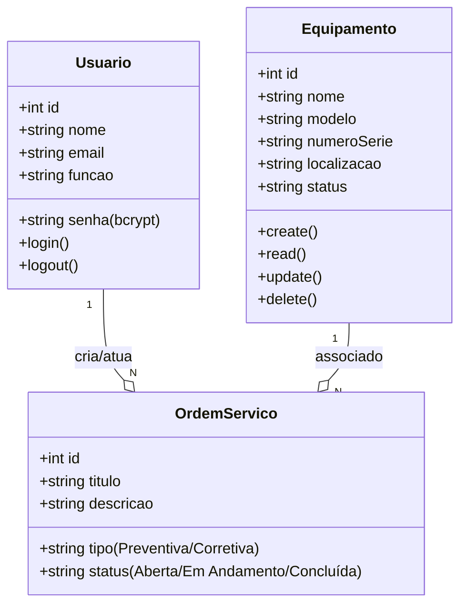

# Sistema de Gestão de Manutenção (Formativa)

## Briefing


## Escopo

- Objetivos:

- Público-Alvo:

- Recursos Tecnológicos:

- Diagramas 

----

## Diagramas 

---

- **Diagrama de Classes**



- *Explicação:*

- Um Usuario (Técnico) pode ser responsável por várias OrdemServico (Ordens de Serviço).
-  Um Equipamento (Equipamento) pode estar associado a várias OrdemServico.
- Uma OrdemServico é criada por um Usuario (Gestor ou Administrador) e está associada a exatamente um equipamento e um técnico responsável.

-------

- **Diagrama de Casos de Uso**

```mermaid
<<<<<<< HEAD
graph TD
    subgraph Sistema de Gestão de Manutenção (SGM)
        uc1("Fazer Login")
        uc2("Gerenciar Equipamentos (CRUD)")
        uc3("Gerenciar Ordens de Serviço (CRUD)")
        uc4("Visualizar Dashboard")
        uc5("Gerenciar Usuários")
    end

    actor "Técnico de Manutenção" as Tecnico
    actor "Gestor de Manutenção" as Gestor
    actor "Administrador" as Admin

    Tecnico -- uc1
    Tecnico -- uc3
    Tecnico -- uc4

    Gestor -- uc1
    Gestor -- uc2
    Gestor -- uc3
    Gestor -- uc4

    Admin -- uc5
    Admin -- Gestor

    uc3 --|> uc1 : include
    uc2 --|> uc1 : include
    uc4 --|> uc1 : include
    uc5 --|> uc1 : include
=======
flowchart TD
    T[Técnico] --> UC1[Login no sistema]
    T --> UC2[Visualizar Dashboard]
    T --> UC3[Gerenciar Ordens de Serviço]

    G[Gestor] --> UC1
    G --> UC2
    G --> UC3
    G --> UC4[Gerenciar Equipamentos]

    A[Administrador] --> UC1
    A --> UC5[Gerenciar Usuários]
>>>>>>> 26152a66774fac5c6ee890cd8294e58d9f4b74de

```

- *Explicação:*

- Atores: Técnico, Gestor e Administrador.

- *Casos de Uso:*

- Técnico: Pode fazer login, gerenciar (visualizar e atualizar status) ordens de serviço e visualizar o dashboard.
- Gestor de Manutenção: Tem as mesmas permissões do técnico e, adicionalmente, pode gerenciar (criar, editar, excluir) equipamentos e ordens de serviço.
- Administrador: Herda as permissões do gestor e também pode gerenciar usuários.
- Relação include: Para acessar qualquer funcionalidade principal (gerenciar equipamentos, ordens, etc.), o usuário deve primeiro "Fazer Login".
--------

- **Diagrama de Fluxo**

```mermaid

graph TD
    A[Início] --> B{Acessa a Tela de Login};
    B --> C[Preenche E-mail e Senha];
    C --> D{Clica em "Entrar"};
    D --> E{Sistema Valida Credenciais?};
    E -- Sim --> F[Gera Token JWT];
    F --> G[Armazena Token no Cliente];
    G --> H{Redireciona para o Dashboard};
    H --> I[Exibe Ordens de Serviço];
    I --> J[Fim];
    E -- Não --> K[Exibe Mensagem de Erro];
    K --> B;

```

- *Explicação:*

- O fluxo começa quando o usuário acessa a tela de login.
- Ele insere suas credenciais (e-mail e senha).
- O sistema verifica se as credenciais são válidas.
    - Se sim: Um token de autenticação (JWT) é gerado, armazenado no navegador do cliente, e o usuário é redirecionado para o dashboard, onde os dados são exibidos.
    - Se não: Uma mensagem de erro é exibida, e o usuário permanece na tela de login para tentar novamente.


## Análise de Risco


## Prototipagem


## Codificação

