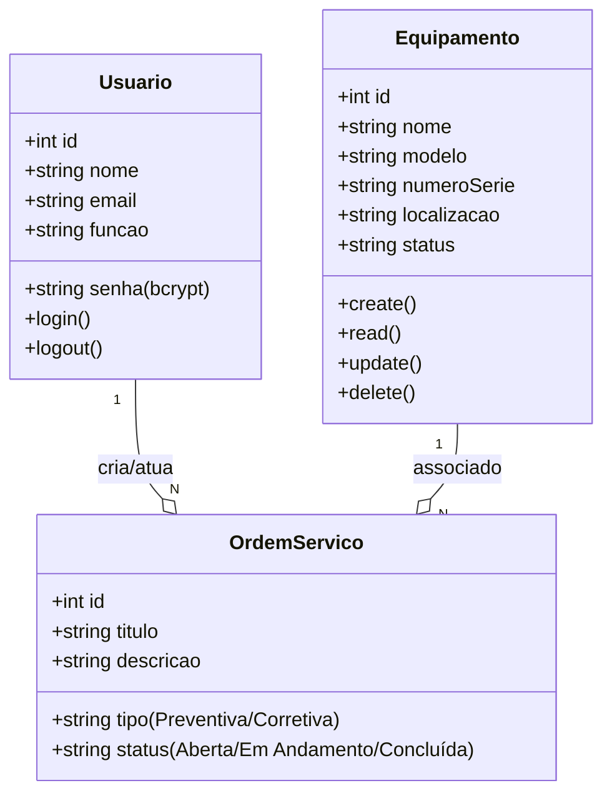
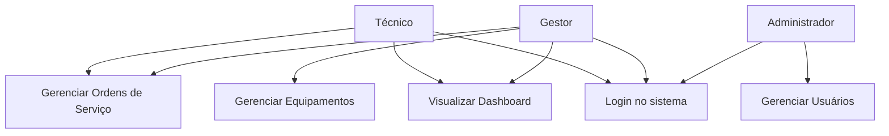
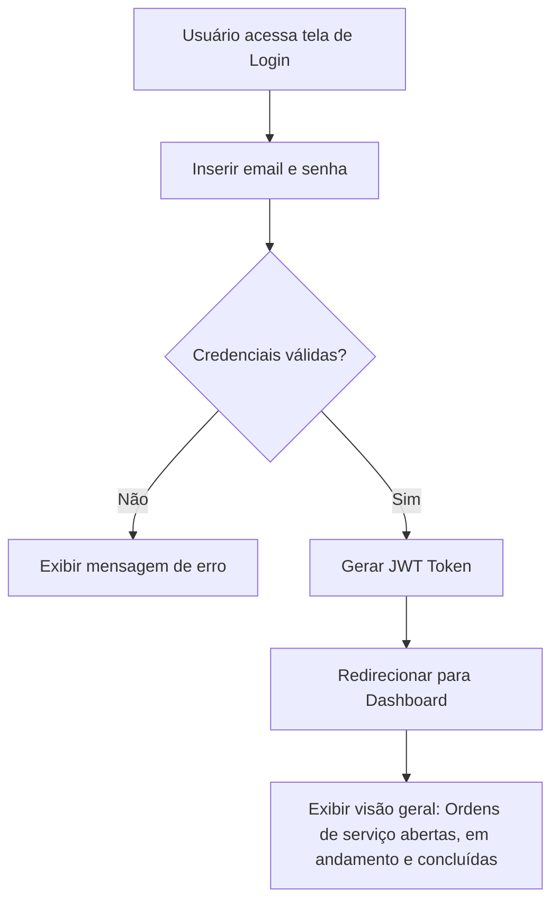

# Sistema de Gestão de Manutenção (Formativa)

## Briefing

## Escopo

- Objetivos:

- Público-Alvo:

- Recursos Tecnológicos:

- Diagramas 

----

## Diagramas 

---

- **Diagrama de Classes**

-------

- **Diagrama de Casos de Uso**

--------

- **Diagrama de Fluxo**

## Análise de Risco

## Prototipagem

## Codificação

