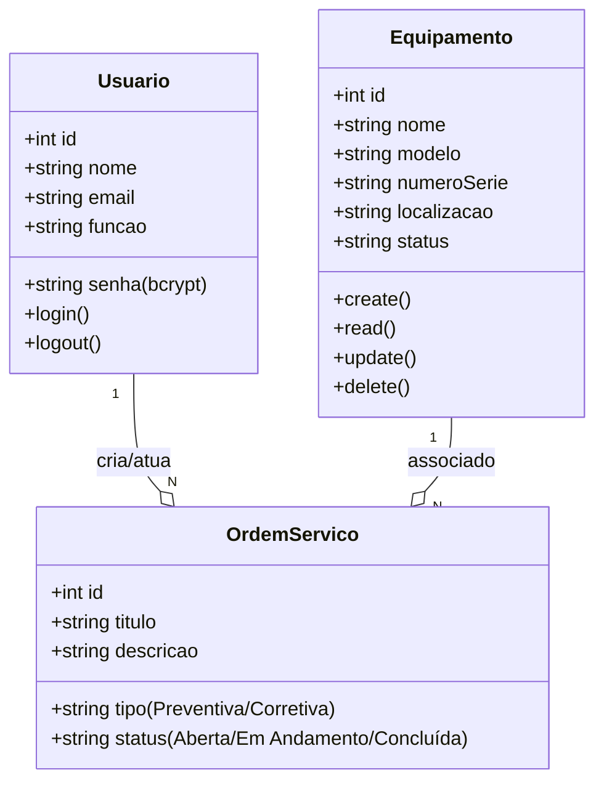
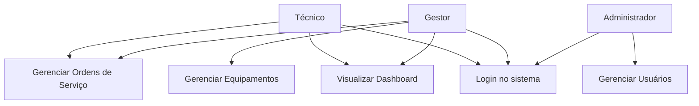
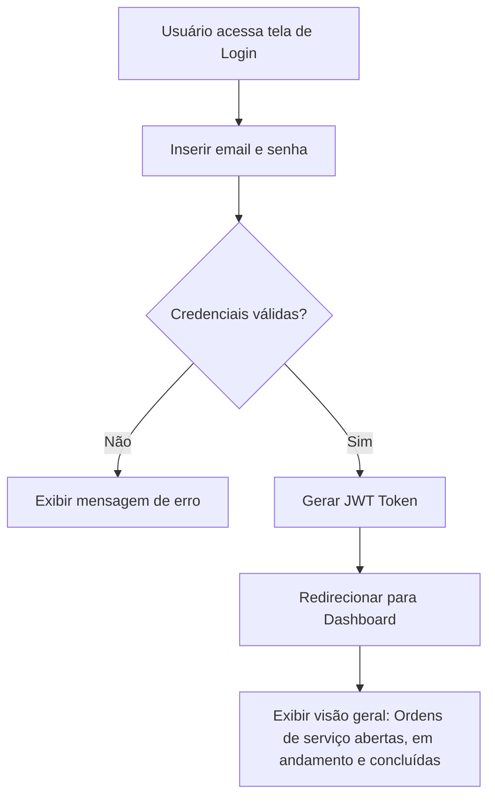

# Sistema de Gestão de Manutenção (Formativa)
-----
## Briefing
------
## Escopo
--------
- Objetivos:

- Público-Alvo:

- Recursos Tecnológicos:

- Diagramas 

----

## Diagramas 

---

- **Diagrama de Classes**

- Um Usuario (Técnico) pode ser responsável por várias OrdemServico (Ordens de Serviço).
-  Um Equipamento (Equipamento) pode estar associado a várias OrdemServico.
- Uma OrdemServico é criada por um Usuario (Gestor ou Administrador) e está associada a exatamente um equipamento e um técnico responsável.
-------

- **Diagrama de Casos de Uso**

 *Explicação:*
- Atores: Técnico, Gestor e Administrador.

*Casos de Uso:*
- Técnico: Pode fazer login, gerenciar (visualizar e atualizar status) ordens de serviço e visualizar o dashboard.
- Gestor de Manutenção: Tem as mesmas permissões do técnico e, adicionalmente, pode gerenciar (criar, editar, excluir) equipamentos e ordens de serviço.
- Administrador: Herda as permissões do gestor e também pode gerenciar usuários.
- Relação include: Para acessar qualquer funcionalidade principal (gerenciar equipamentos, ordens, etc.), o usuário deve primeiro "Fazer Login".

--------

- **Diagrama de Fluxo**

*Explicação:*

- O fluxo começa quando o usuário acessa a tela de login.
- Ele insere suas credenciais (e-mail e senha).
- O sistema verifica se as credenciais são válidas.
    - Se sim: Um token de autenticação (JWT) é gerado, armazenado no navegador do cliente, e o usuário é redirecionado para o dashboard, onde os dados são exibidos.
    - Se não: Uma mensagem de erro é exibida, e o usuário permanece na tela de login para tentar novamente.

----

## Análise de Risco

A tabela abaixo apresenta os riscos identificados no projeto **SGM**, organizados por categoria, junto com a probabilidade, impacto e estratégias de mitigação propostas.

---

## Riscos Técnicos

| ID  | Risco                                     | Probabilidade | Impacto | Mitigação |
|-----|-------------------------------------------|---------------|---------|-----------|
| 1   | Chave secreta do JWT comprometida         | Média         | Alto    | Utilizar chaves secretas longas e complexas, armazená-las em variáveis de ambiente e implementar política de rotação de chaves. |
| 2   | Vulnerabilidade de truncamento do Bcrypt  | Baixa         | Alto    | Garantir que a entrada para o hashing de senha nunca exceda 72 bytes e tratar a senha de forma isolada, sem concatenação. |
| 3   | Lentidão do sistema com aumento de dados  | Média         | Média   | Otimizar consultas com indexação, implementar paginação e planejar arquitetura para escalabilidade futura. |
| 4   | Código de baixa qualidade com bugs        | Alta          | Média   | Adotar práticas de código limpo, revisões de código (code review) e testes unitários e de integração contínua. |

---

## Riscos de Gerenciamento

| ID  | Risco                             | Probabilidade | Impacto | Mitigação |
|-----|-----------------------------------|---------------|---------|-----------|
| 5   | Aumento do escopo (Scope Creep)   | Alta          | Média   | Formalizar processo de controle de mudanças e avaliar impacto em prazo/custo antes da aprovação. |
| 6   | Atraso na entrega do projeto      | Alta          | Média   | Utilizar metodologias ágeis, reavaliar cronograma a cada sprint e manter comunicação transparente sobre progresso. |
| 7   | Requisitos mal interpretados      | Média         | Alto    | Validar protótipos e wireframes com usuários finais e manter comunicação constante para esclarecimento. |

---

## Riscos Organizacionais

| ID  | Risco                                    | Probabilidade | Impacto | Mitigação |
|-----|------------------------------------------|---------------|---------|-----------|
| 8   | Resistência dos usuários à nova ferramenta | Média       | Alto    | Envolver usuários-chave desde o início, criar interface amigável (UI/UX) e comunicar benefícios do sistema. |
| 9   | Inserção de dados incorretos no sistema  | Média         | Alto    | Implementar validações robustas nos formulários e, se possível, importar/validar dados existentes. |
| 10  | Falta de treinamento para os usuários    | Média         | Média   | Criar manuais de usuário, realizar treinamentos práticos por perfil (técnico, gestor, administrador) e oferecer suporte. |

---

## Prototipagem

Link da Prototipagem: https://www.figma.com/design/ZdnNUfb144XMvIxtUXXWTF/Sem-t%C3%ADtulo?node-id=0-1&t=MnQ9PMxsIFFDVDiV-1

## Codificação

